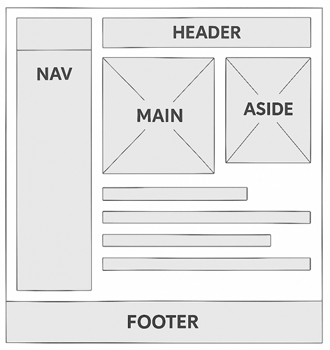
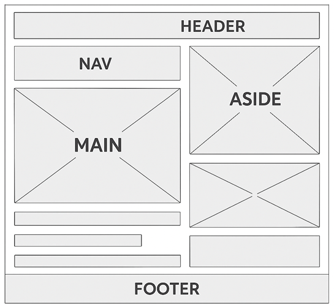
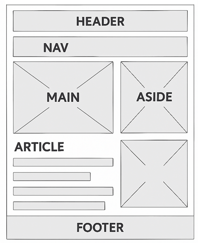
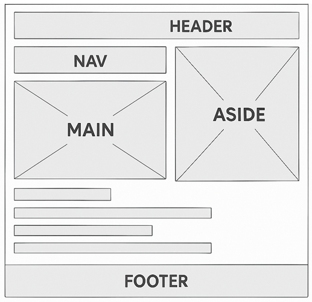

# 🌐 Introduction to Web Page Layout Design

> [!NOTE]
> The material was created with the help of ChatGPT and Copilot.

## 🧭 Why Layout Matters

The **layout** of a web page is much more than just where things appear — it’s the **foundation of visual communication** on the web. A good layout helps users understand what’s important, navigate easily, and enjoy the overall experience. In short:

* 🧩 **Structure** gives meaning to content
* 👁️ **Visual hierarchy** guides the reader’s eye
* ⚡ **Usability** ensures smooth interaction
* 💬 **Brand identity** is reinforced through consistent design

A well-thought-out layout makes a web page *feel intuitive* and *look professional*. Conversely, a poor layout can confuse visitors, reduce trust, and cause them to leave the site.

---

## 🕰️ A Brief History of Web Layouts

The evolution of web layout reflects both **technological progress** and **changing design philosophies**:

---

**🖥️ 1990s — The Table Era**

In the early web, designers used **HTML tables** to position text and images. This was a creative workaround, but it made sites heavy, inflexible, and hard to maintain.

> 💡 Example: Websites often looked like printed brochures with rigid grids.

---

**🎨 2000s — CSS Takes Over**

The introduction of **CSS (Cascading Style Sheets)** revolutionized web design. Designers could separate content from presentation, leading to:

* Cleaner code
* Faster pages
* More flexible layouts

The concept of **semantic HTML** also emerged — focusing on meaning rather than appearance.

---

**📱 2010s — The Responsive Revolution**

With the rise of smartphones, designers had to rethink layout. **Responsive design** (introduced around 2010) made pages adapt to any screen size using:

* **Media queries**
* **Flexible grids**
* **Fluid images**

Frameworks like **Bootstrap** and **Tailwind CSS** made responsive design faster and more accessible.

---

**⚙️ 2020s — Modern CSS and Design Systems**

New CSS technologies like **Flexbox**, **Grid**, and **Clamp()** have made layout creation powerful and precise. Designers now think in **systems**, creating reusable components and consistent design languages.

---

## 🚀 The Future of Layout Design

The future of web layouts is shaped by **automation**, **accessibility**, and **personalization**:

* 🤖 **AI-assisted design** — tools can suggest or generate layouts automatically based on content.
* ♿ **Inclusive design** — layouts will increasingly adapt to *user needs*, not just screen sizes (e.g., dark mode, dyslexia-friendly spacing).
* 🧠 **Adaptive layouts** — future sites might rearrange content dynamically depending on behavior or context.
* 🌍 **Immersive and 3D experiences** — as VR/AR and WebGL become mainstream, “layout” will extend beyond flat screens.

The essence of layout will remain the same: **to connect people with information in the clearest, most meaningful way possible.**

---

## ✨ Key Takeaway

> “Design is not just what it looks like and feels like. Design is how it works.”
> — *Steve Jobs*

A great web layout is a conversation between **form and function**. It blends **aesthetics, structure, and usability** — turning simple code into an engaging human experience.

---

# 🧱 The Stages of Layout Design

Designing a web page layout is a **step-by-step creative process** that transforms an idea into an interactive user experience. Each phase builds on the previous one, ensuring both **clarity** and **consistency**.

---

## 🪄 1. Concept and Planning

Before drawing anything, designers begin with **planning**.
This stage answers key questions:

* Who is the **target audience**?
* What is the **purpose** of the page? (inform, sell, entertain, etc.)
* What kind of **content** will be included?
* What are the **user journeys** — how will visitors navigate?

🎯 The goal is to define the **information architecture** — how content and navigation are logically organized.

---

## ✏️ 2. Wireframing — The Blueprint of Design

A **wireframe** is like the *skeleton* of a website.
It shows **structure and layout**, without focusing on colors, images, or typography.

Think of it as a **blueprint for a building** — before painting walls, you must decide where the rooms go.

Wireframes help designers and developers:

* Visualize the page hierarchy
* Place elements (headers, sidebars, footers, buttons, forms)
* Identify usability issues early
* Communicate ideas clearly within a team

🧩 Wireframes are simple by design — they focus on **function and layout**, not decoration.

---

## 🗂️ Categories of Wireframes

Wireframes can vary in detail depending on the stage of the project.
There are **three main categories**:

### 🩶 1. Low-Fidelity (Lo-Fi) Wireframes

* Simple black-and-white sketches (often done on paper or with tools like Balsamiq or Figma).
* Focus on **layout and placement**, not appearance.
* Useful for early discussions and brainstorming.

> Example: Boxes for images, lines for text, “X” marks for pictures.

---

### 🎛️ 2. Mid-Fidelity (Mid-Fi) Wireframes

* Created digitally, showing more structure and spacing accuracy.
* Include **basic typography, alignment, and navigation**.
* Used for **testing layout flow** and user experience (UX).

> Example: You can already test the flow of buttons, forms, and menus, but design still remains grayscale.

---

### 🎨 3. High-Fidelity (Hi-Fi) Wireframes (or Prototypes)

* Almost look like real web pages.
* Include **colors, fonts, icons, and real images**.
* Often **interactive**, allowing testing of clicks, scrolls, and animations.
* Used for **usability testing** and **final design approval**.

> Example: Figma or Adobe XD prototypes that behave like the finished product.

---

## 🧩 3. Mockups and Prototyping

After wireframing, designers move to **mockups** — visual versions of layouts that apply branding, color schemes, and typography.
Then come **prototypes**, which simulate interaction.

🧠 **Mockup** = how it looks  
⚙️ **Prototype** = how it works

This phase bridges the gap between **static layout** and **user interaction**.

---

## 🧰 4. Development and Implementation

Once the layout and visuals are approved, developers bring the design to life using:

* **HTML** for structure
* **CSS** for styling
* **JavaScript** for interactivity

Frameworks like **Tailwind CSS**, **Bootstrap**, or **React components** help ensure the layout remains **responsive and consistent** across devices.

---

## 🔍 5. Testing and Refinement

Before launch, designers test:

* 🖱️ Navigation and usability
* 📱 Responsiveness on different devices
* 🧩 Accessibility (screen readers, contrast, keyboard navigation)
* ⏱️ Performance and loading speed

Feedback from users helps refine the layout before final publication.

---

## 🌟 Summary

| Phase                   | Goal                                 | Output                            |
| ----------------------- | ------------------------------------ | --------------------------------- |
| 1. Planning             | Define goals, structure, and content | Information architecture          |
| 2. Wireframing          | Outline layout and functionality     | Lo-Fi → Mid-Fi → Hi-Fi wireframes |
| 3. Mockups & Prototypes | Add visuals and interactivity        | Visual design + UX flow           |
| 4. Development          | Implement the layout in code         | Responsive web page               |
| 5. Testing              | Ensure quality and accessibility     | Polished, user-friendly site      |

---

## 💡 Key Takeaway

> “Wireframes turn ideas into structure. Without structure, even the most beautiful design will fail.”

Layouts don’t start with color — they start with **clarity**.
A well-planned wireframe ensures every pixel has a purpose and every element serves the user.

---

# 🧱 Mastering Web Layouts

**Building structure with purpose and style**

Every website is built on a layout — the invisible grid that shapes how users see, read, and interact. From the timeless header–footer combo to bold hero sections and elegant grids, each layout tells a different story.

Below are five classic approaches that form the foundation of modern web design.

## 1. 🧭 Classic Header–Content–Footer Layout

This is the **most traditional and widely used layout** on the web.
It consists of three main sections:

* **Header:** usually contains the site’s logo, navigation menu, and sometimes a search bar.
* **Content (Main):** the central area that displays the primary information or functionality of the page.
* **Footer:** placed at the bottom, it often includes copyright information, contact links, or social media icons.

🧩 *Ideal for:* simple websites, blogs, and pages with clear top-to-bottom reading flow.  
💡 *Strength:* easy to understand and navigate; works well on all screen sizes.

**Structure:**  
```
<header> at the top  
<nav> inside header or below it  
<main> in the center  
<aside> optional, next to main  
<footer> at the bottom
```

**Example:**


---

### ✅ 1.1. What changes from desktop to mobile?
1.  **Single-column layout**:
    - All elements stack vertically for easy scrolling.
    - **Header → Nav → Main → Aside → Footer** in natural reading order.

2. **Navigation**:
   - Horizontal nav becomes a stacked menu or collapsible hamburger for space efficiency.

3. **Aside**:
   - Moves below main content instead of being on the right side.

4. **Footer**:
   - Remains full-width at the bottom, but now closer to aside.

5. **Content scaling**:
   - Images and text blocks shrink to fit smaller screens.
   - Padding and margins adjust for touch-friendly spacing.

**Example:**


---

## 2. 📚 Sidebar Layout

In this design, the page is divided into a **main content area** and one or more **sidebars** (usually on the left or right).
Sidebars are used for **navigation menus, filters, or additional tools** that complement the main content.

📚 *Example:* an online store where the sidebar contains product categories and the main area shows product listings.  
💡 *Strength:* keeps navigation or extra info visible while browsing; supports multi-tasking and interaction.

**Structure:**  
```
<header> at the top  
<nav> vertical on the left sidebar  
<main> large area on the right  
<aside> optional, below nav or on the far right  
<footer> full width at bottom
```

**Example:**



---

### ✅ 2.1. What changes from desktop to mobile?
1. **Sidebar disappears as a column**:
   - The `<nav>` that was in a vertical sidebar now moves below the header or becomes a hamburger menu for space efficiency.

2. **Single-column stacking**:
   - **Header → Nav → Main → Aside → Footer** in natural reading order.
   - No horizontal split; everything is stacked vertically.

3. **Aside moves down**:
   - Instead of being next to main content, ASIDE is placed below the main section.

4. **Footer remains full-width**:
   - Positioned at the bottom, same as desktop but now closer to aside.

5. **Touch-friendly adjustments**:
   - Larger buttons, simplified navigation, and reduced text width for readability.

---

## 3. 🧩 Grid-Based Layout

This layout uses a **grid system** (rows and columns) to organize content.
The design is modular and flexible, allowing multiple elements (cards, images, text blocks) to align neatly in both directions.

🧱 *Example:* a portfolio, image gallery, or news site with repeating content blocks.  
💡 *Strength:* visually balanced and easy to make responsive with CSS Grid or Flexbox.

**Structure:**  
```
<header> spans full width  
<nav> horizontal below header  
<main> split into multiple <section> or <article> blocks  
<aside> placed in a grid cell next to main  
<footer> spans full width
```

**Example:**



---

### ✅ 3.1. What changes from desktop to mobile?
1. **Grid collapses into a single column**:
   - All grid cells stack vertically: **Header → Nav → Main → Aside → Footer**.
   - No multi-column arrangement.

2. **Navigation**:
   - Horizontal nav becomes stacked or collapsible.

3. **Aside moves below main content**:
   - Secondary info is placed after primary content for natural reading order.

4. **Footer remains full-width**:
   - Positioned at the bottom as in desktop.

---

## 4. 🌄 Hero Layout

A **hero layout** emphasizes a large visual or message at the top of the page — often called a **hero section**.
It usually includes a striking image or video background, a headline, a short description, and a call-to-action button.

🎯 *Example:* landing pages and product promotions that need to grab attention immediately.  
💡 *Strength:* great for storytelling, branding, and conversions — instantly communicates the page’s purpose.

**Structure:**  
```
<header> at top  
<nav> inside header or below  
<main> starts with a large hero <section> (image + CTA)  
<article> below hero for detailed content  
<aside> optional, for related links  
<footer> at bottom
```

**Example:**



---

### ✅ 4.1. What changes from desktop to mobile?
1. **Hero section scales down**:
   - The large hero image or banner in `<main>` becomes narrower and fits the screen width.
   - Text and call-to-action buttons stack vertically for readability.

2. **Single-column flow**:
   - All elements stack vertically:  
     **Header → Nav → Main (Hero) → Article → Aside → Footer**.

3. **Navigation adapts**:
   - Horizontal nav becomes a stacked list or collapsible hamburger menu.

4. **Article and Aside move down**:
   - Instead of being beside the hero, they appear below it in natural reading order.

5. **Spacing and touch optimization**:
   - Increased padding for buttons and links.
   - Larger font sizes for readability on small screens.

---

## 5. 📰 Multi-Column Layout

This approach displays content in **two or more columns**, often used in magazines, blogs, and news sites.
It mimics traditional print layouts, allowing users to scan different sections or articles side by side.

📰 *Example:* an online magazine with feature stories in one column and quick news in another.  
💡 *Strength:* presents a lot of information efficiently; helps separate different content types.

**Structure:**  
```
<header> top  
<nav> horizontal  
<main> divided into 2–3 columns using <section> or <article>  
<aside> in one column for secondary info  
<footer> bottom
```

**Example:**



---

### ✅ 5.1. What changes from desktop to mobile?
1. **Columns collapse into a single column**:
   - The two or three columns used for `<main>` and `<aside>` stack vertically.
   - Reading order becomes **Header → Nav → Main → Aside → Footer**.

2. **Navigation adapts**:
   - Horizontal navigation bar becomes stacked or collapsible (hamburger menu).

3. **Content scaling**:
   - Images and text blocks shrink to fit smaller screens.
   - Padding and margins adjust for touch-friendly spacing.

4. **Aside moves below main content**:
   - Secondary information is placed after primary content for natural reading flow.

5. **Footer remains full-width**:
   - Positioned at the bottom, same as desktop.

---

# 🎓 Responsive Layout Patterns with Tailwind (without Nav and Aside)

## 🧱 1. Classic Header–Content–Footer

```html
<!DOCTYPE html>
<html lang="en">
<head>
  <meta charset="UTF-8" />
  <script src="https://cdn.tailwindcss.com"></script>
  <title>Classic Layout</title>
</head>
<body class="flex flex-col min-h-screen text-gray-800">
  <header class="bg-blue-500 text-white p-4 text-center">Header</header>
  <main class="flex-grow p-6 bg-gray-50 text-center">Main Content</main>
  <footer class="bg-gray-800 text-white p-4 text-center">Footer</footer>
</body>
</html>
```

---

## 📚 2. Sidebar Layout

```html
<!DOCTYPE html>
<html lang="en">
<head>
  <meta charset="UTF-8" />
  <script src="https://cdn.tailwindcss.com"></script>
  <title>Sidebar Layout</title>
</head>
<body class="flex flex-col min-h-screen text-gray-800">
  <header class="bg-indigo-600 text-white p-4 text-center">Header</header>

  <div class="flex flex-grow">
    <aside class="w-1/4 bg-gray-200 p-4">Sidebar</aside>
    <main class="flex-grow bg-gray-50 p-6 text-center">Main Content</main>
  </div>

  <footer class="bg-gray-800 text-white p-4 text-center">Footer</footer>
</body>
</html>
```

---

## 🧩 3. Grid-Based Layout

```html
<!DOCTYPE html>
<html lang="en">
<head>
  <meta charset="UTF-8" />
  <script src="https://cdn.tailwindcss.com"></script>
  <title>Grid Layout</title>
</head>
<body class="flex flex-col min-h-screen text-gray-800">
  <header class="bg-green-500 text-white p-4 text-center">Header</header>

  <main class="flex-grow p-6 bg-gray-50 grid grid-cols-1 sm:grid-cols-2 md:grid-cols-3 gap-4">
    <div class="bg-white p-4 shadow rounded">Card 1</div>
    <div class="bg-white p-4 shadow rounded">Card 2</div>
    <div class="bg-white p-4 shadow rounded">Card 3</div>
    <div class="bg-white p-4 shadow rounded">Card 4</div>
    <div class="bg-white p-4 shadow rounded">Card 5</div>
    <div class="bg-white p-4 shadow rounded">Card 6</div>
  </main>

  <footer class="bg-gray-800 text-white p-4 text-center">Footer</footer>
</body>
</html>
```

---

## 🌄 4. Hero Layout

```html
<!DOCTYPE html>
<html lang="en">
<head>
  <meta charset="UTF-8" />
  <script src="https://cdn.tailwindcss.com"></script>
  <title>Hero Layout</title>
</head>
<body class="flex flex-col min-h-screen text-gray-800">
  <header class="bg-gray-900 text-white p-4 text-center">Header</header>

  <section class="bg-blue-500 text-white text-center py-20">
    <h1 class="text-4xl font-bold mb-4">Welcome to Our Page</h1>
    <p class="text-lg mb-6">Simple hero section with a call-to-action</p>
    <button class="bg-white text-blue-600 px-4 py-2 rounded hover:bg-blue-100">Get Started</button>
  </section>

  <main class="flex-grow p-6 bg-gray-50 text-center">Main Content</main>
  <footer class="bg-gray-800 text-white p-4 text-center">Footer</footer>
</body>
</html>
```

---

## 📰 5. Multi-Column Layout

```html
<!DOCTYPE html>
<html lang="en">
<head>
  <meta charset="UTF-8" />
  <script src="https://cdn.tailwindcss.com"></script>
  <title>Multi-Column Layout</title>
</head>
<body class="flex flex-col min-h-screen text-gray-800">
  <header class="bg-teal-600 text-white p-4 text-center">Header</header>

  <main class="flex-grow bg-gray-50 p-6 grid md:grid-cols-3 gap-4">
    <article class="bg-white p-4 shadow rounded">Column 1 content</article>
    <article class="bg-white p-4 shadow rounded">Column 2 content</article>
    <article class="bg-white p-4 shadow rounded">Column 3 content</article>
  </main>

  <footer class="bg-gray-800 text-white p-4 text-center">Footer</footer>
</body>
</html>
```

---

# 🎓 Responsive Layout Patterns with Tailwind (without Aside)

## 🧱 1. Classic Header–Content–Footer (with Nav)

```html
<!DOCTYPE html>
<html lang="en">
<head>
  <meta charset="UTF-8" />
  <script src="https://cdn.tailwindcss.com"></script>
  <title>Classic Layout</title>
</head>
<body class="flex flex-col min-h-screen text-gray-800">
  <header class="bg-blue-500 text-white">
    <nav class="flex flex-wrap justify-center gap-6 p-4">
      <a href="#" class="hover:underline">Home</a>
      <a href="#" class="hover:underline">About</a>
      <a href="#" class="hover:underline">Contact</a>
    </nav>
  </header>

  <main class="flex-grow p-6 bg-gray-50 text-center">Main Content</main>

  <footer class="bg-gray-800 text-white p-4 text-center">Footer</footer>
</body>
</html>
```

---

## 📚 2. Sidebar Layout (with Nav)

```html
<!DOCTYPE html>
<html lang="en">
<head>
  <meta charset="UTF-8" />
  <script src="https://cdn.tailwindcss.com"></script>
  <title>Sidebar Layout</title>
</head>
<body class="flex flex-col min-h-screen text-gray-800">
  <header class="bg-indigo-600 text-white">
    <nav class="flex justify-center gap-6 p-4">
      <a href="#" class="hover:underline">Dashboard</a>
      <a href="#" class="hover:underline">Profile</a>
      <a href="#" class="hover:underline">Settings</a>
    </nav>
  </header>

  <div class="flex flex-grow">
    <aside class="w-1/4 bg-gray-200 p-4">
      <ul class="space-y-2">
        <li><a href="#" class="block hover:underline">Menu 1</a></li>
        <li><a href="#" class="block hover:underline">Menu 2</a></li>
        <li><a href="#" class="block hover:underline">Menu 3</a></li>
      </ul>
    </aside>
    <main class="flex-grow bg-gray-50 p-6 text-center">Main Content</main>
  </div>

  <footer class="bg-gray-800 text-white p-4 text-center">Footer</footer>
</body>
</html>
```

---

## 🧩 3. Grid-Based Layout (with Nav)

```html
<!DOCTYPE html>
<html lang="en">
<head>
  <meta charset="UTF-8" />
  <script src="https://cdn.tailwindcss.com"></script>
  <title>Grid Layout</title>
</head>
<body class="flex flex-col min-h-screen text-gray-800">
  <header class="bg-green-600 text-white">
    <nav class="flex justify-center gap-6 p-4">
      <a href="#" class="hover:underline">Gallery</a>
      <a href="#" class="hover:underline">Portfolio</a>
      <a href="#" class="hover:underline">Contact</a>
    </nav>
  </header>

  <main class="flex-grow p-6 bg-gray-50 grid grid-cols-1 sm:grid-cols-2 md:grid-cols-3 gap-4">
    <div class="bg-white p-4 shadow rounded">Card 1</div>
    <div class="bg-white p-4 shadow rounded">Card 2</div>
    <div class="bg-white p-4 shadow rounded">Card 3</div>
    <div class="bg-white p-4 shadow rounded">Card 4</div>
    <div class="bg-white p-4 shadow rounded">Card 5</div>
    <div class="bg-white p-4 shadow rounded">Card 6</div>
  </main>

  <footer class="bg-gray-800 text-white p-4 text-center">Footer</footer>
</body>
</html>
```

---

## 🌄 4. Hero Layout (with Nav)

```html
<!DOCTYPE html>
<html lang="en">
<head>
  <meta charset="UTF-8" />
  <script src="https://cdn.tailwindcss.com"></script>
  <title>Hero Layout</title>
</head>
<body class="flex flex-col min-h-screen text-gray-800">
  <header class="bg-gray-900 text-white">
    <nav class="flex justify-center gap-6 p-4">
      <a href="#" class="hover:text-blue-400">Home</a>
      <a href="#" class="hover:text-blue-400">Services</a>
      <a href="#" class="hover:text-blue-400">Contact</a>
    </nav>
  </header>

  <section class="bg-blue-500 text-white text-center py-20">
    <h1 class="text-4xl font-bold mb-4">Welcome to Our Page</h1>
    <p class="text-lg mb-6">Simple hero section with a call-to-action</p>
    <button class="bg-white text-blue-600 px-4 py-2 rounded hover:bg-blue-100">Get Started</button>
  </section>

  <main class="flex-grow p-6 bg-gray-50 text-center">Main Content</main>
  <footer class="bg-gray-800 text-white p-4 text-center">Footer</footer>
</body>
</html>
```

---

## 📰 5. Multi-Column Layout (with Nav)

```html
<!DOCTYPE html>
<html lang="en">
<head>
  <meta charset="UTF-8" />
  <script src="https://cdn.tailwindcss.com"></script>
  <title>Multi-Column Layout</title>
</head>
<body class="flex flex-col min-h-screen text-gray-800">
  <header class="bg-teal-600 text-white">
    <nav class="flex justify-center gap-6 p-4">
      <a href="#" class="hover:underline">News</a>
      <a href="#" class="hover:underline">Features</a>
      <a href="#" class="hover:underline">Subscribe</a>
    </nav>
  </header>

  <main class="flex-grow bg-gray-50 p-6 grid md:grid-cols-3 gap-4">
    <article class="bg-white p-4 shadow rounded">Column 1 content</article>
    <article class="bg-white p-4 shadow rounded">Column 2 content</article>
    <article class="bg-white p-4 shadow rounded">Column 3 content</article>
  </main>

  <footer class="bg-gray-800 text-white p-4 text-center">Footer</footer>
</body>
</html>
```

---

# 🎓 Responsive Layout Patterns with Tailwind

## 🧱 1. Classic Header–Content–Footer + Nav + Aside

```html
<!DOCTYPE html>
<html lang="en">
<head>
  <meta charset="UTF-8" />
  <script src="https://cdn.tailwindcss.com"></script>
  <title>Classic Layout</title>
</head>
<body class="flex flex-col min-h-screen text-gray-800">
  <header class="bg-blue-500 text-white">
    <nav class="flex flex-wrap justify-center gap-6 p-4">
      <a href="#" class="hover:underline">Home</a>
      <a href="#" class="hover:underline">About</a>
      <a href="#" class="hover:underline">Contact</a>
    </nav>
  </header>

  <main class="flex-grow p-6 bg-gray-50 flex flex-col md:flex-row gap-6 text-center">
    <section class="flex-1 bg-white p-4 shadow rounded">Main Content</section>
    <aside class="w-full md:w-1/4 bg-gray-200 p-4 rounded">Related Info / Ads</aside>
  </main>

  <footer class="bg-gray-800 text-white p-4 text-center">Footer</footer>
</body>
</html>
```

---

## 📚 2. Sidebar Layout + Nav + Aside

```html
<!DOCTYPE html>
<html lang="en">
<head>
  <meta charset="UTF-8" />
  <script src="https://cdn.tailwindcss.com"></script>
  <title>Sidebar Layout</title>
</head>
<body class="flex flex-col min-h-screen text-gray-800">
  <header class="bg-indigo-600 text-white">
    <nav class="flex justify-center gap-6 p-4">
      <a href="#" class="hover:underline">Dashboard</a>
      <a href="#" class="hover:underline">Profile</a>
      <a href="#" class="hover:underline">Settings</a>
    </nav>
  </header>

  <div class="flex flex-grow">
    <aside class="w-1/5 bg-gray-200 p-4">
      <ul class="space-y-2">
        <li><a href="#" class="block hover:underline">Menu 1</a></li>
        <li><a href="#" class="block hover:underline">Menu 2</a></li>
        <li><a href="#" class="block hover:underline">Menu 3</a></li>
      </ul>
    </aside>

    <main class="flex-grow bg-gray-50 p-6 text-center">Main Content</main>

    <aside class="hidden lg:block w-1/5 bg-gray-100 p-4 rounded">Extra Info</aside>
  </div>

  <footer class="bg-gray-800 text-white p-4 text-center">Footer</footer>
</body>
</html>
```

---

## 🧩 3. Grid-Based Layout + Nav + Aside

```html
<!DOCTYPE html>
<html lang="en">
<head>
  <meta charset="UTF-8" />
  <script src="https://cdn.tailwindcss.com"></script>
  <title>Grid Layout</title>
</head>
<body class="flex flex-col min-h-screen text-gray-800">
  <header class="bg-green-600 text-white">
    <nav class="flex justify-center gap-6 p-4">
      <a href="#" class="hover:underline">Gallery</a>
      <a href="#" class="hover:underline">Portfolio</a>
      <a href="#" class="hover:underline">Contact</a>
    </nav>
  </header>

  <div class="flex flex-grow flex-col md:flex-row">
    <main class="flex-grow p-6 bg-gray-50 grid grid-cols-1 sm:grid-cols-2 lg:grid-cols-3 gap-4">
      <div class="bg-white p-4 shadow rounded">Card 1</div>
      <div class="bg-white p-4 shadow rounded">Card 2</div>
      <div class="bg-white p-4 shadow rounded">Card 3</div>
      <div class="bg-white p-4 shadow rounded">Card 4</div>
      <div class="bg-white p-4 shadow rounded">Card 5</div>
      <div class="bg-white p-4 shadow rounded">Card 6</div>
    </main>

    <aside class="w-full md:w-1/4 bg-gray-200 p-4">Tags / Filters</aside>
  </div>

  <footer class="bg-gray-800 text-white p-4 text-center">Footer</footer>
</body>
</html>
```

---

## 🌄 4. Hero Layout + Nav + Aside

```html
<!DOCTYPE html>
<html lang="en">
<head>
  <meta charset="UTF-8" />
  <script src="https://cdn.tailwindcss.com"></script>
  <title>Hero Layout</title>
</head>
<body class="flex flex-col min-h-screen text-gray-800">
  <header class="bg-gray-900 text-white">
    <nav class="flex justify-center gap-6 p-4">
      <a href="#" class="hover:text-blue-400">Home</a>
      <a href="#" class="hover:text-blue-400">Services</a>
      <a href="#" class="hover:text-blue-400">Contact</a>
    </nav>
  </header>

  <section class="bg-blue-500 text-white text-center py-20">
    <h1 class="text-4xl font-bold mb-4">Welcome to Our Page</h1>
    <p class="text-lg mb-6">Simple hero section with a call-to-action</p>
    <button class="bg-white text-blue-600 px-4 py-2 rounded hover:bg-blue-100">Get Started</button>
  </section>

  <div class="flex flex-grow flex-col md:flex-row">
    <main class="flex-grow p-6 bg-gray-50 text-center">Main Content</main>
    <aside class="w-full md:w-1/4 bg-gray-200 p-4">Announcements</aside>
  </div>

  <footer class="bg-gray-800 text-white p-4 text-center">Footer</footer>
</body>
</html>
```

---

## 📰 5. Multi-Column Layout + Nav + Aside

```html
<!DOCTYPE html>
<html lang="en">
<head>
  <meta charset="UTF-8" />
  <script src="https://cdn.tailwindcss.com"></script>
  <title>Multi-Column Layout</title>
</head>
<body class="flex flex-col min-h-screen text-gray-800">
  <header class="bg-teal-600 text-white">
    <nav class="flex justify-center gap-6 p-4">
      <a href="#" class="hover:underline">News</a>
      <a href="#" class="hover:underline">Features</a>
      <a href="#" class="hover:underline">Subscribe</a>
    </nav>
  </header>

  <div class="flex flex-grow flex-col md:flex-row">
    <main class="flex-grow bg-gray-50 p-6 grid md:grid-cols-3 gap-4">
      <article class="bg-white p-4 shadow rounded">Column 1</article>
      <article class="bg-white p-4 shadow rounded">Column 2</article>
      <article class="bg-white p-4 shadow rounded">Column 3</article>
    </main>

    <aside class="w-full md:w-1/4 bg-gray-200 p-4">Sidebar Content</aside>
  </div>

  <footer class="bg-gray-800 text-white p-4 text-center">Footer</footer>
</body>
</html>
```